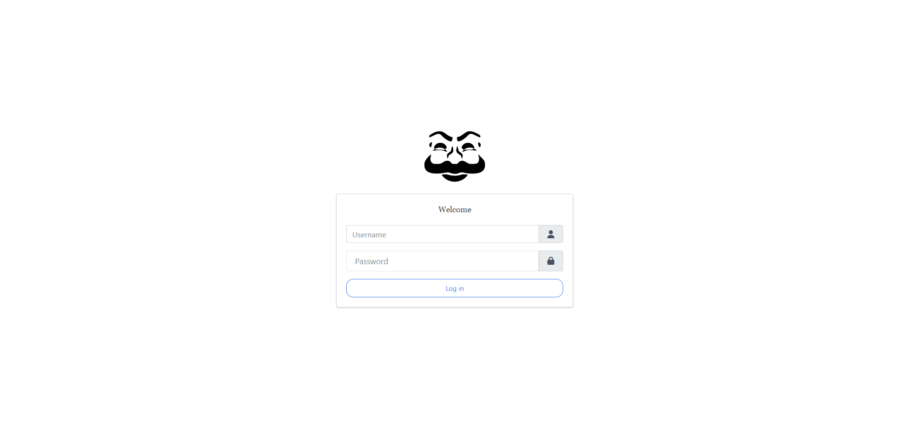
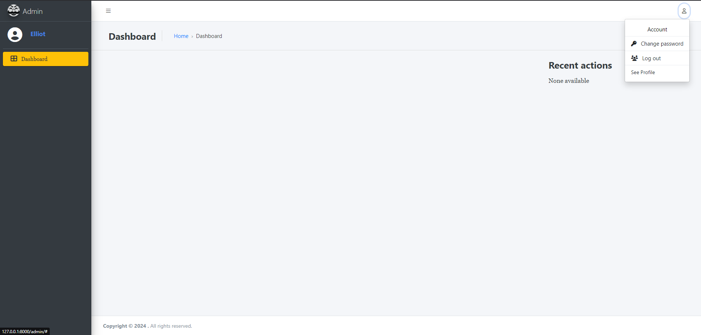
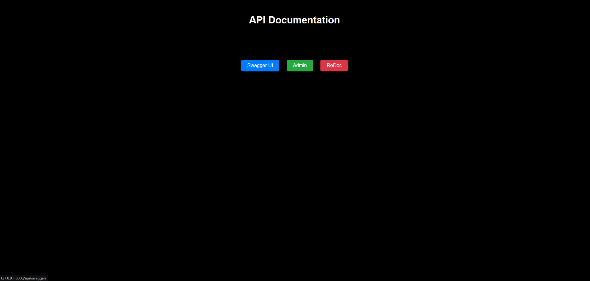
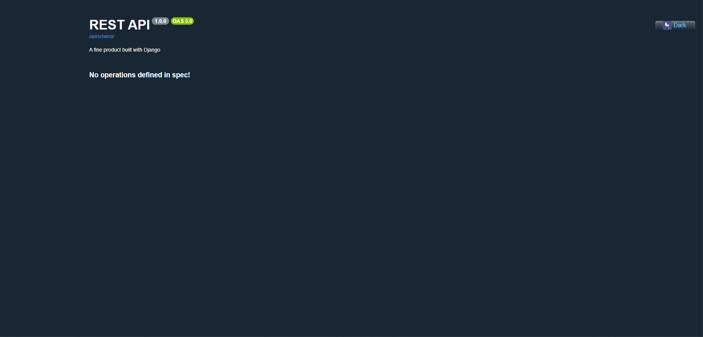

# Django Boilerplate

Django Boilerplate is a **production-ready** Django project template pre-configured with essential libraries, a modern admin interface, Docker support, and a raw query show middleware for API optimization. It's designed to help you quickly start building applications with minimal setup.

## Features

- **Pre-installed Libraries**:
  - **Django REST Framework** (`rest_framework`): Build powerful APIs with ease.
  - **CORS Headers** (`corsheaders`): Handle Cross-Origin Resource Sharing in your APIs.
  - **DRF Spectacular** (`drf_spectacular`): Automatic and customizable API documentation.
  - **JWT Authentication** (`rest_framework_simplejwt.token_blacklist`): Secure user authentication with JWT tokens.
  - **CKEditor 5** (`django_ckeditor_5`): Rich text editor for enhanced content creation in the admin panel.

- **Admin Panel**:
  - **Jazzmin**: A modern and user-friendly admin interface for better manageability.
  - 
  - 

- **Docker Configured**:
  - Docker support for both development and production environments.
  - `docker-compose` configuration for easy deployment and scalability.

- **Raw Query Show Middleware**:
  - A middleware is included to **display raw SQL queries** executed behind the scenes in API views. This feature helps you to monitor and optimize queries for better performance.

- **Swagger Dark Mode**:
  - **Swagger UI** comes with a **dark mode** feature for users who prefer working in low-light environments.
  - 
  - 
  
- **Production-Ready**:
  - Secure defaults and environment-specific settings to quickly deploy your project to production.
  - Customizable settings for easy adaptation to your app’s needs.

## Quick Start

1. **Clone the repository**:
   ```bash
   git clone <repository-url>
   cd <project-folder>
   ```
2. **Set up a virtual environment**
   - For Linux
   ```bash
   python3 -m venv venv
   . venv/bin/activate
   ```
   - For Windows
   ```bash
   python -m venv venv
   .\venv\Scripts\activate
    ```
3. **Install project dependencies**
    ```bash
    pip install -r requirements.txt
    touch .env
    ```
    Note: Use the env_example file to correctly configure the environment variables in your .env file.
